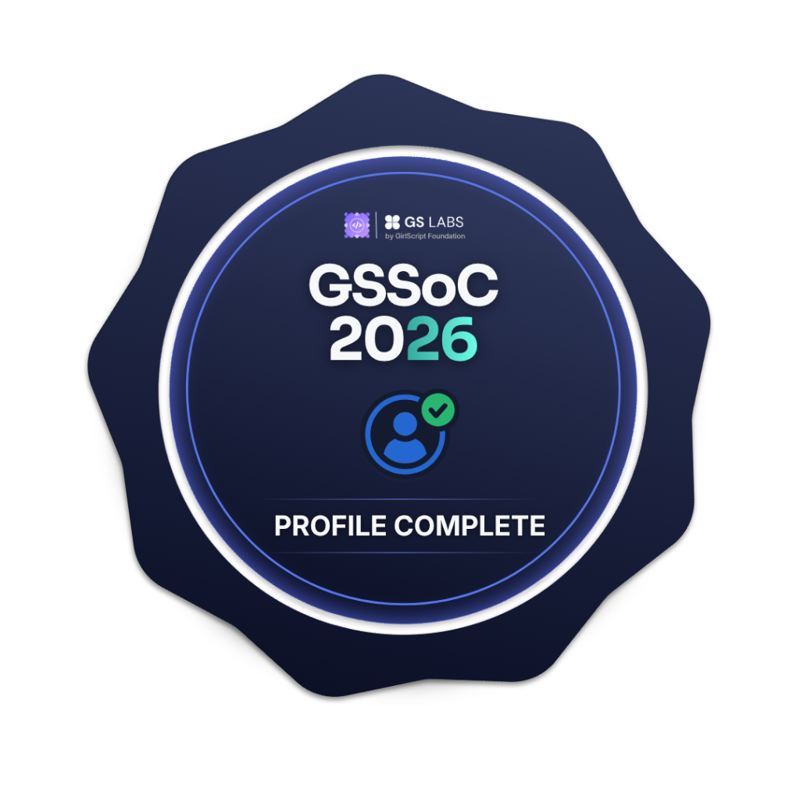
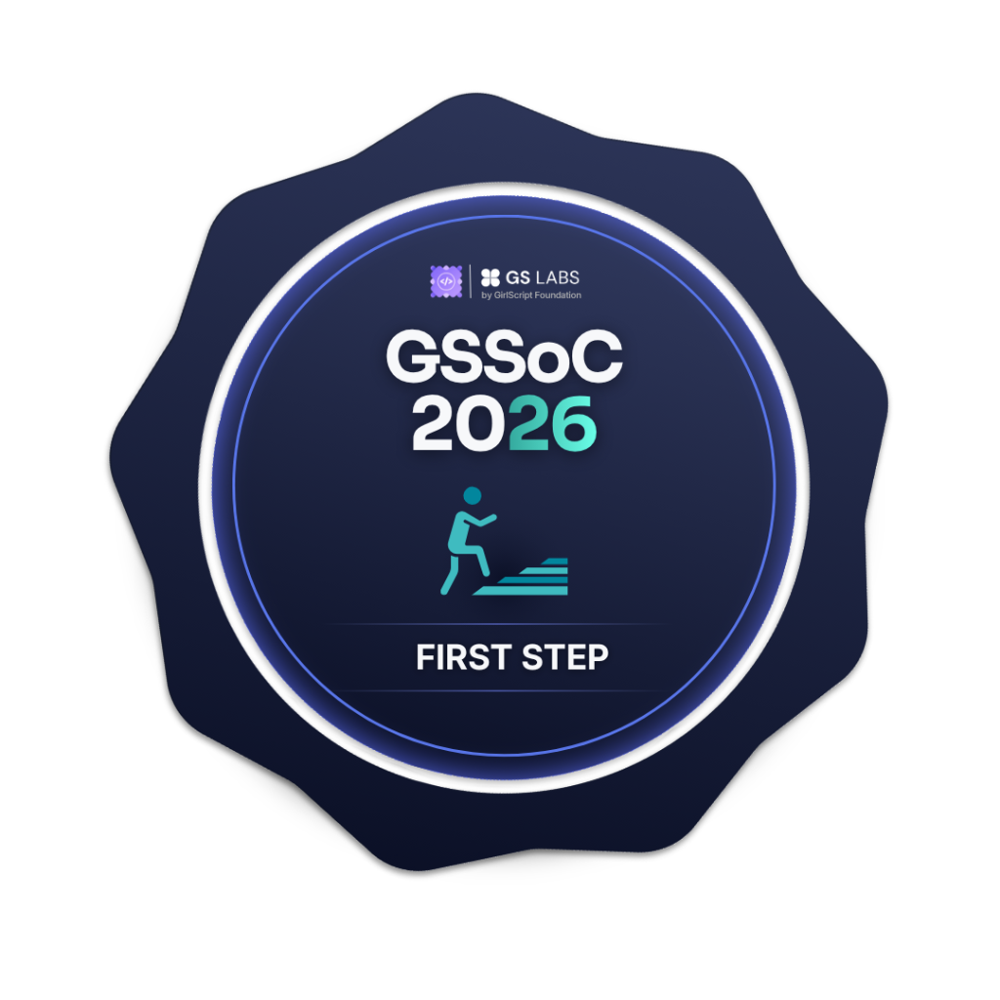
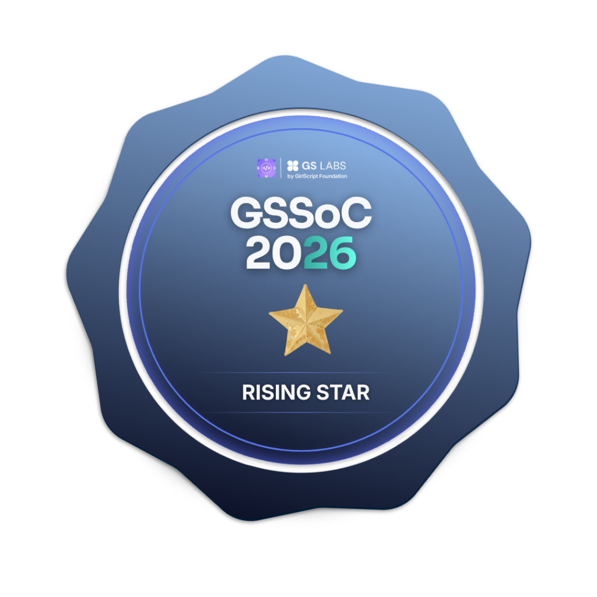
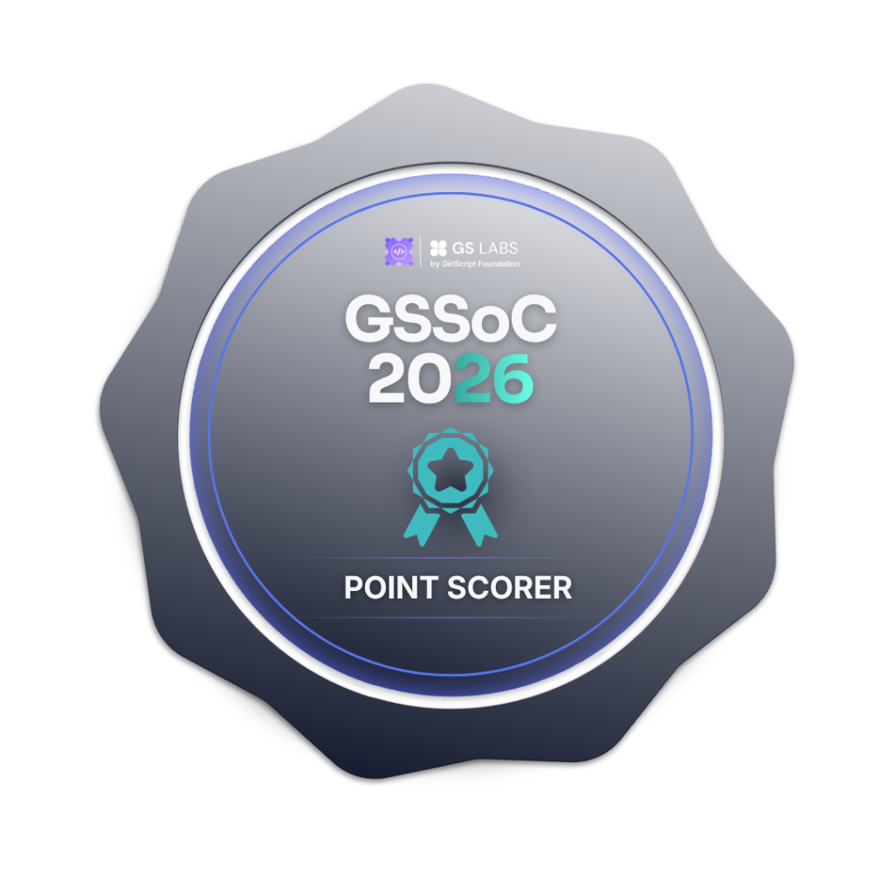
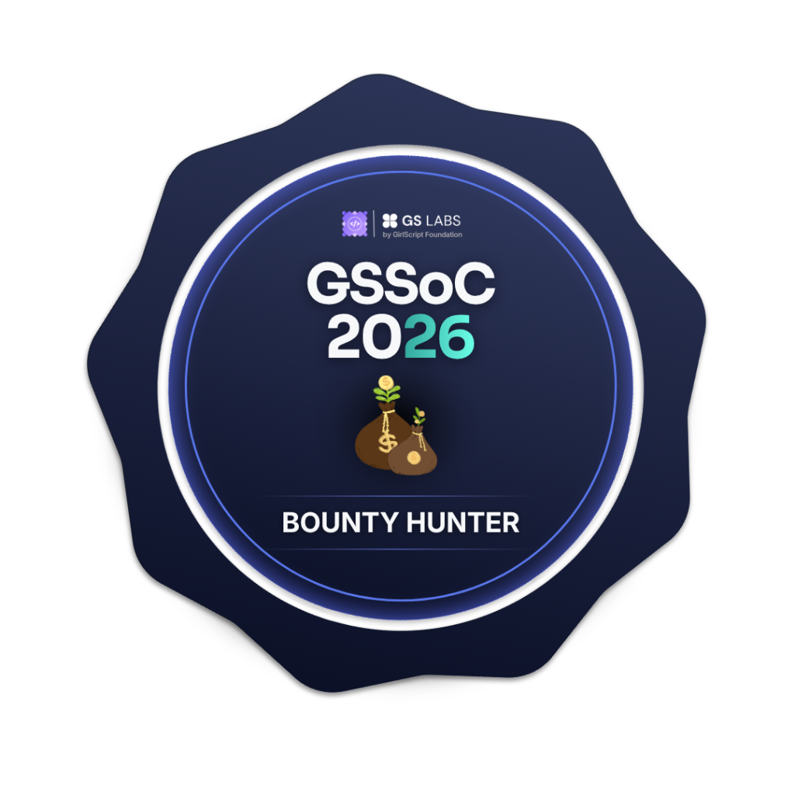
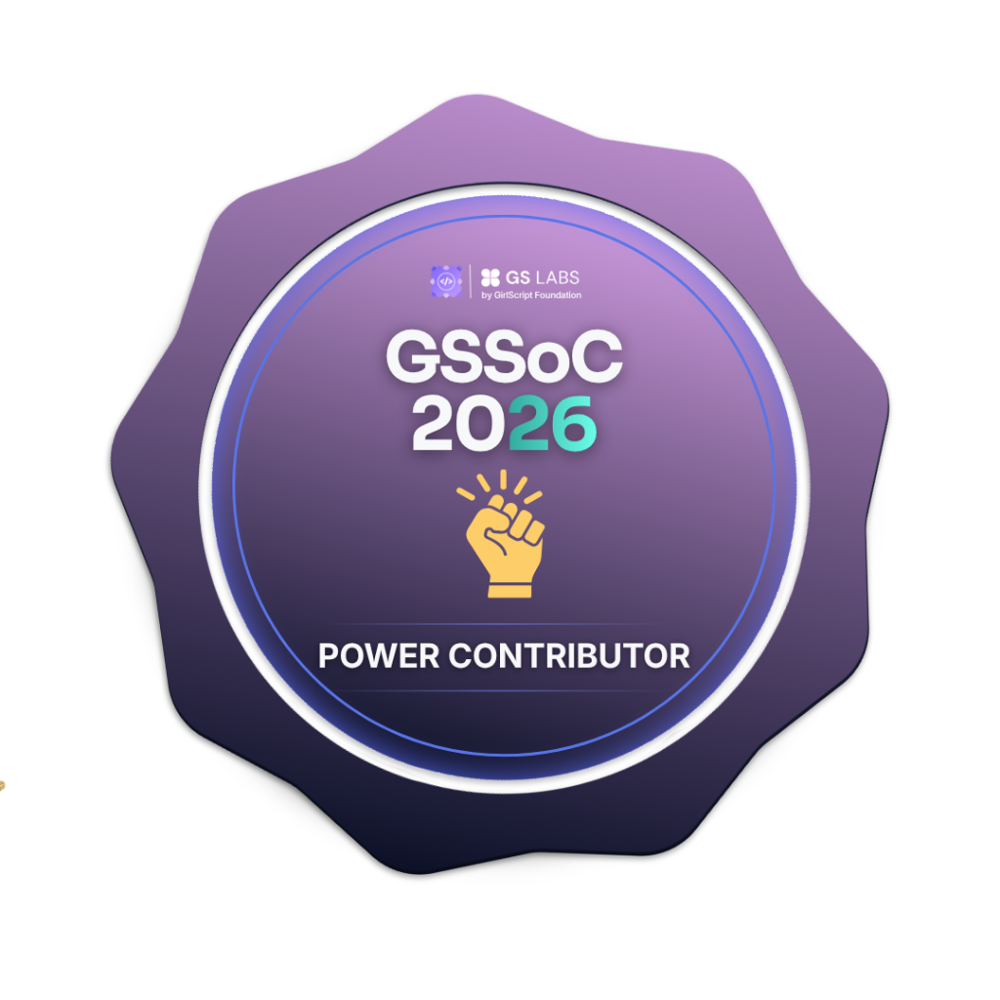
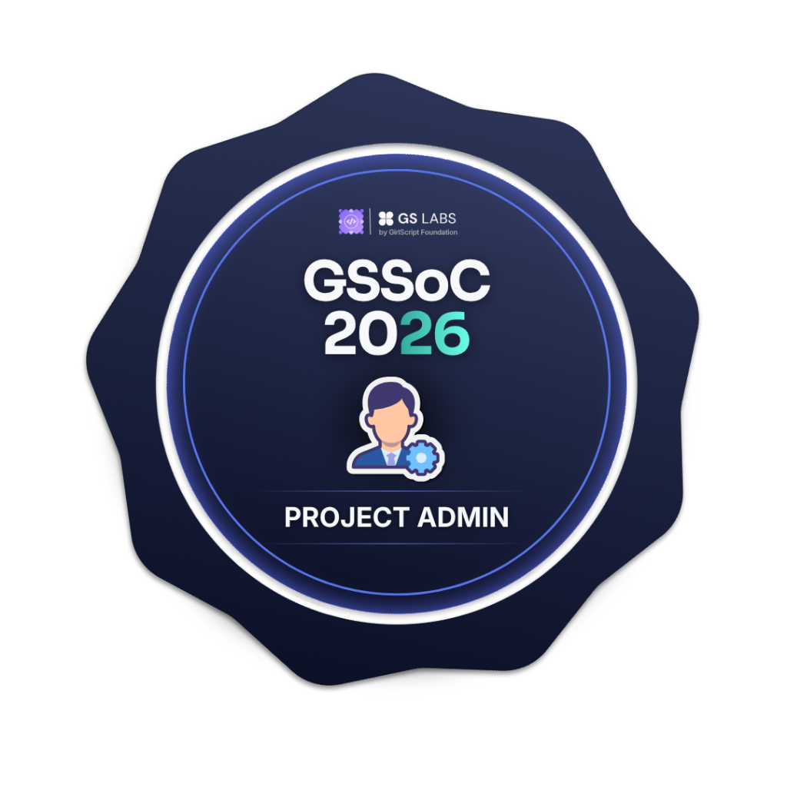
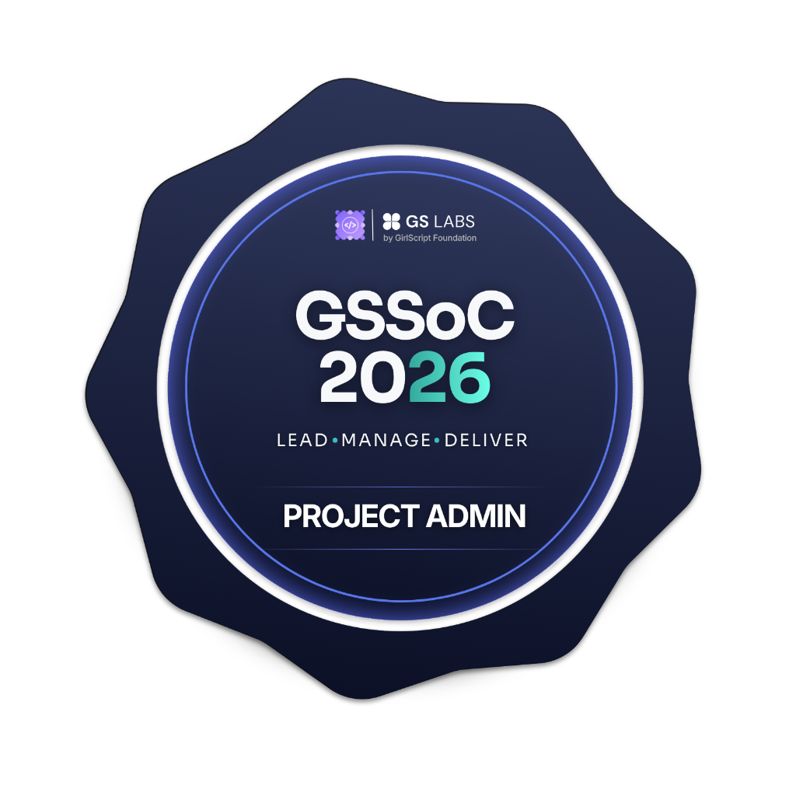

<h1 align="center">Hi 👋, I'm Aarush Gupta</h1>

  

<h3 align="center">
🚀 B.Tech CSE Student | 🤖 Robotics & Systems Builder | 🌐 Frontend Developer | 🎨 Design & Hardware Enthusiast
</h3>

---

# 🧠 About Me

- 🔭 Working on **<a href="https://portfolio-aarush-gupta.vercel.app">My Portfolio Website</a>**
- 🚀 Currently building **<a href="https://take-one-nexus.vercel.app">Take One Website</a>**
- 🤝 Open to **Open Source & Tech Collaborations**
- 🌱 Currently learning **System Design, DevOps & ROS2**
- 💬 Ask me about **Web Development, Robotics, CAD & Projects**
- ⚡ **Build fast. Learn faster. Improve forever.**

---

# 🚀 Featured Work

🔹 **Developer Portfolio**  
🔹 **Robotics Projects**  
🔹 **Hardware + Software Integrations**  
🔹 **Datacron Fest Website**

---

# 🛠️ Engineering & Design

---

# 🌐 Software & Web

---

# 📊 GitHub Stats

---

# 🔥 GitHub Streak

  

---

# 📅 Contribution Heatmap

  

---

# 📈 Contribution Graph

  

---

# 🏆 GitHub Trophies

  

---

# 🧩 Problem Solving Stats

  

---

# 🏅 GSSoC'26 Badges

  
  
  
  
  
  
  
  
  

---

# 🤝 Connect With Me

---

# 💡 Quote

> ### **Build fast. Learn faster. Improve forever. 🚀**
